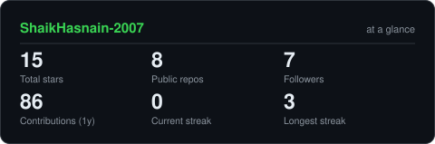
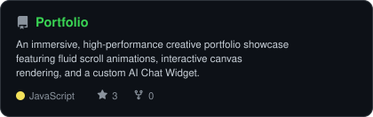
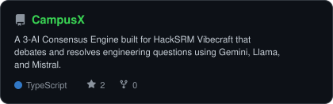
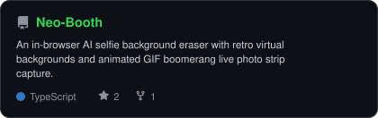
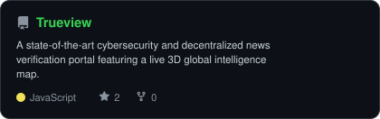

<div align="center">

<!-- PORTRAIT - generated by scripts/dotify.py from assets/avatar.png -->


<br>

<!-- NAME / TAGLINE - animated typing -->
<a href="https://github.com/ShaikHasnain-2007">
  
</a>

<br>

<!-- SOCIALS -->
<a href="https://www.linkedin.com/in/shaik-hasnain-sh0709"></a>
<a href="mailto:shaikhasnain2007@gmail.com"></a>
<a href="https://shaikhasnain0709.web.app/"></a>
<a href="https://www.instagram.com/shaik_hasnain99"></a>


</div>

---

## `~/` whoami

```console
$ cat about.txt
```

Hi, I'm **Shaik Hasnain**. I'm a **B.Tech CSE (AI/ML)** undergraduate at **SRM University-AP** who balances coursework with rapid-fire hackathons. I specialize in engineering full-stack applications and generating precise digital AI concepts.

- 🔭 Currently building **[Neo-Booth](https://github.com/ShaikHasnain-2007/Neo-Booth)** — an in-browser AI selfie background eraser with retro virtual backgrounds
- 🌐 Portfolio: **[shaikhasnain0709.web.app](https://shaikhasnain0709.web.app/)**
- ⚡ Learning: **Advanced local AI orchestration & cinematic 1990s retro aesthetics**
- 🏀 Fun fact: **"You need to run before you can walk"**

<br>

<div align="center">

## `~/` toolbox


</div>

---

<div align="center">

## `~/` skill radar

<table>
<tr>
<td width="50%" align="center" valign="middle">

<!-- Self-rated radar - edit assets/skills.json, the workflow redraws it -->
<picture>
  <source media="(prefers-color-scheme: dark)"  srcset="assets/radar-dark.svg">
  <source media="(prefers-color-scheme: light)" srcset="assets/radar-light.svg">
  
</picture>

</td>
<td width="50%" align="center" valign="middle">

<!-- Live radar built from real language byte counts across your repos -->
<picture>
  <source media="(prefers-color-scheme: dark)"  srcset="assets/radar-langs-dark.svg">
  <source media="(prefers-color-scheme: light)" srcset="assets/radar-langs-light.svg">
  
</picture>

</td>
</tr>
</table>

</div>

---

<div align="center">

## `~/` contribution calendar

<!-- 3D isometric calendar, regenerated every 6h by .github/workflows/metrics.yml -->


<br><br>

<!-- Snake eats the contribution graph - .github/workflows/snake.yml -->
<picture>
  <source media="(prefers-color-scheme: dark)"  srcset="https://raw.githubusercontent.com/ShaikHasnain-2007/ShaikHasnain-2007/output/snake-dark.svg">
  <source media="(prefers-color-scheme: light)" srcset="https://raw.githubusercontent.com/ShaikHasnain-2007/ShaikHasnain-2007/output/snake.svg">
  
</picture>

</div>

---

<div align="center">

## `~/` the numbers

<!-- Generated by scripts/cards.py into this repo. Deliberately self-hosted
     to prevent external API downtime from breaking profile badges. -->
<picture>
  <source media="(prefers-color-scheme: dark)"  srcset="assets/card-stats-dark.svg">
  <source media="(prefers-color-scheme: light)" srcset="assets/card-stats-light.svg">
  
</picture>

<br>


<br><br>


</div>

---

<div align="center">

## `~/` selected work

<!-- Cards generated by scripts/cards.py from assets/projects.json.
     Stars, forks and language are pulled live from the API on every run. -->
<table>
<tr>
<td width="50%">
  <a href="https://github.com/ShaikHasnain-2007/Portfolio">
    <picture>
      <source media="(prefers-color-scheme: dark)"  srcset="assets/card-Portfolio-dark.svg">
      <source media="(prefers-color-scheme: light)" srcset="assets/card-Portfolio-light.svg">
      
    </picture>
  </a>
</td>
<td width="50%">
  <a href="https://github.com/ShaikHasnain-2007/CampusX">
    <picture>
      <source media="(prefers-color-scheme: dark)"  srcset="assets/card-CampusX-dark.svg">
      <source media="(prefers-color-scheme: light)" srcset="assets/card-CampusX-light.svg">
      
    </picture>
  </a>
</td>
</tr>
<tr>
<td width="50%">
  <a href="https://github.com/ShaikHasnain-2007/Neo-Booth">
    <picture>
      <source media="(prefers-color-scheme: dark)"  srcset="assets/card-Neo-Booth-dark.svg">
      <source media="(prefers-color-scheme: light)" srcset="assets/card-Neo-Booth-light.svg">
      
    </picture>
  </a>
</td>
<td width="50%">
  <a href="https://github.com/ShaikHasnain-2007/Trueview">
    <picture>
      <source media="(prefers-color-scheme: dark)"  srcset="assets/card-Trueview-dark.svg">
      <source media="(prefers-color-scheme: light)" srcset="assets/card-Trueview-light.svg">
      
    </picture>
  </a>
</td>
</tr>
</table>

<sub>

| project | live | stack |
|---|---|---|
| **[Portfolio](https://github.com/ShaikHasnain-2007/Portfolio)** | [shaikhasnain0709.web.app](https://shaikhasnain0709.web.app/) | `React 19` `Vite` `Tailwind CSS` `GSAP` `Framer Motion` `Firebase` |
| **[CampusX](https://github.com/ShaikHasnain-2007/CampusX)** | [github.com/ShaikHasnain-2007/CampusX](https://github.com/ShaikHasnain-2007/CampusX) | `Next.js` `Tailwind CSS` `Python` `FastAPI` `Vercel` |
| **[Neo-Booth](https://github.com/ShaikHasnain-2007/Neo-Booth)** | [neo-booth.vercel.app](https://neo-booth.vercel.app/) | `React` `TypeScript` `Vite` |
| **[Trueview](https://github.com/ShaikHasnain-2007/Trueview)** | [trueview-delta.vercel.app](https://trueview-delta.vercel.app/) | `HTML5` `CSS3` `JavaScript` `Three.js` `Node.js` `Express` |

</sub>

</div>

---

<div align="center">

<sub>`01110100 01101000 01100001 01101110 01101011 01110011 00100000 01100110 01101111 01110010 00100000 01110011 01100011 01100010 01101111 01101100 01101100 01101001 01101110 01100111`</sub>

</div>
